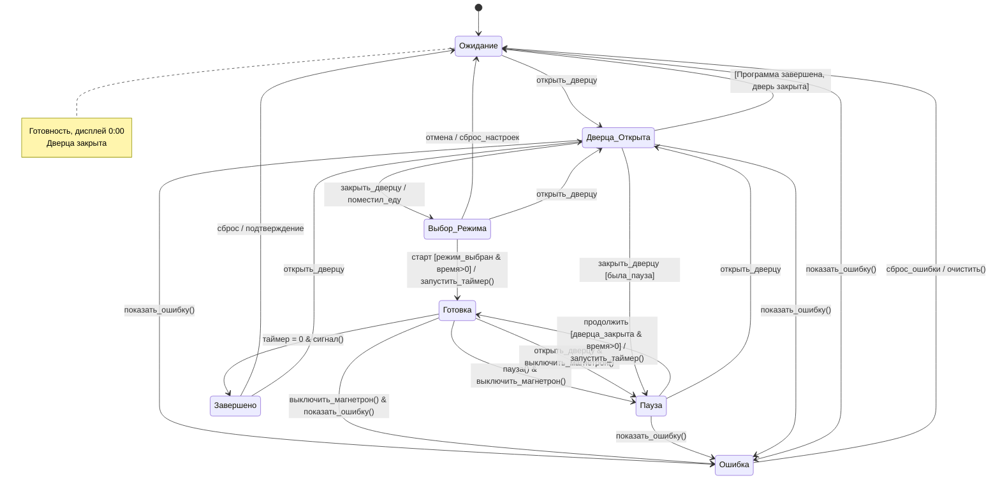

# Диаграмма конечных автоматов работы микроволновой печи

```mermaid
stateDiagram-v2
    [*] --> Ожидание
    note right of Ожидание
        Готовность, дисплей 0:00
        Дверца закрыта
    end note

    Ожидание --> Дверца_Открыта: открыть_дверцу
    Дверца_Открыта --> Выбор_Режима: закрыть_дверцу / поместил_еду
    Дверца_Открыта --> Ожидание: [Программа завершена, дверь закрыта]
    Дверца_Открыта --> Ошибка: показать_ошибку()

    Выбор_Режима --> Ожидание: отмена / сброс_настроек
    Выбор_Режима --> Готовка: старт [режим_выбран & время>0] / запустить_таймер()
    Выбор_Режима --> Дверца_Открыта: открыть_дверцу

    Готовка --> Пауза: пауза() & выключить_магнетрон()
    Готовка --> Пауза: открыть_дверцу & выключить_магнетрон()
    Готовка --> Завершено: таймер = 0 & сигнал()
    Готовка --> Ошибка: выключить_магнетрон() & показать_ошибку()

    Пауза --> Готовка: продолжить [дверца_закрыта & время>0] / запустить_таймер()
    Пауза --> Дверца_Открыта: открыть_дверцу
    Пауза --> Ошибка: показать_ошибку()

    Дверца_Открыта --> Пауза: закрыть_дверцу [была_пауза]
    Дверца_Открыта --> Ошибка: показать_ошибку()

    Завершено --> Ожидание: сброс / подтверждение
    Завершено --> Дверца_Открыта: открыть_дверцу

    Ожидание --> Ошибка: показать_ошибку()
    Ошибка --> Ожидание: сброс_ошибки / очистить()
```

# Временная диаграмма готовки в микроволновой печи

