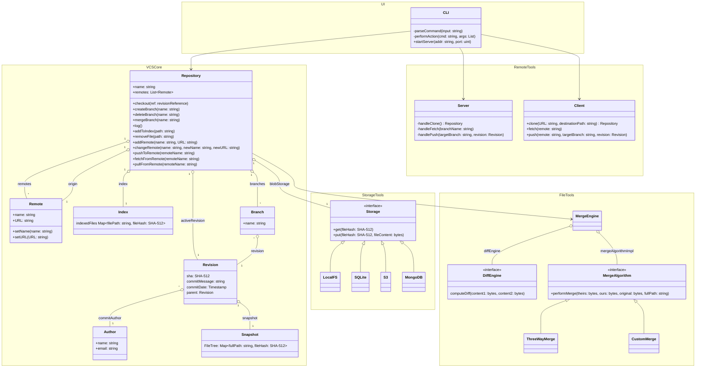
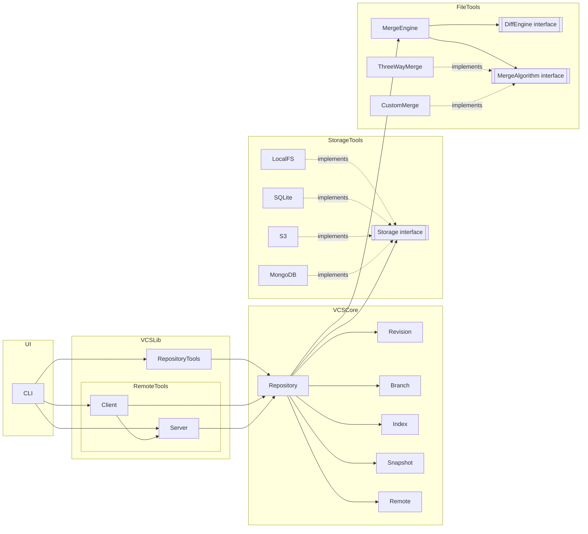

# Система контроля версий

VCS разделена на 2 основных части: одна реализует непосредственно CLI с валидацией пользовательского ввода,
вторая — библиотека, абстрагирующая пользовательский интерфейс от работы с локальным и удалённым хранилищем.

Репозиторий — это дерево из коммитов. Каждый коммит содержит ссылку на дерево, которое хранит в себе
информацию о содержимом объектов/файлов в репозитории. Объекты хранятся в сжатом виде и адресуются по хэшу
содержимого. Хранилище по хэшу можно абстрагировать и реализовать как в виде файлов в локальной
ФС, так и в удалённом хранилище.

## Диаграмма классов

## Диаграммма компонентов

