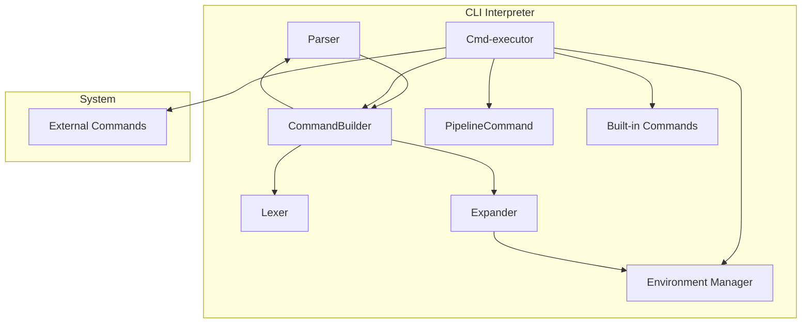
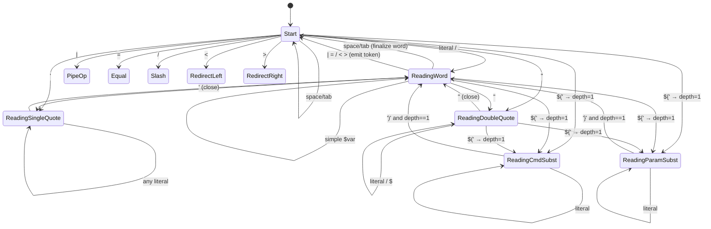
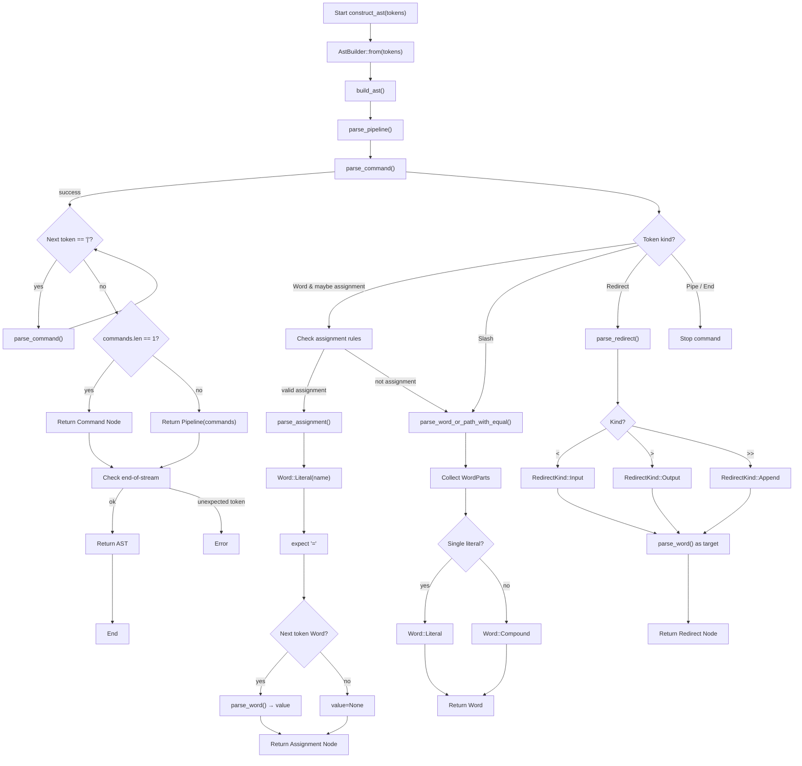
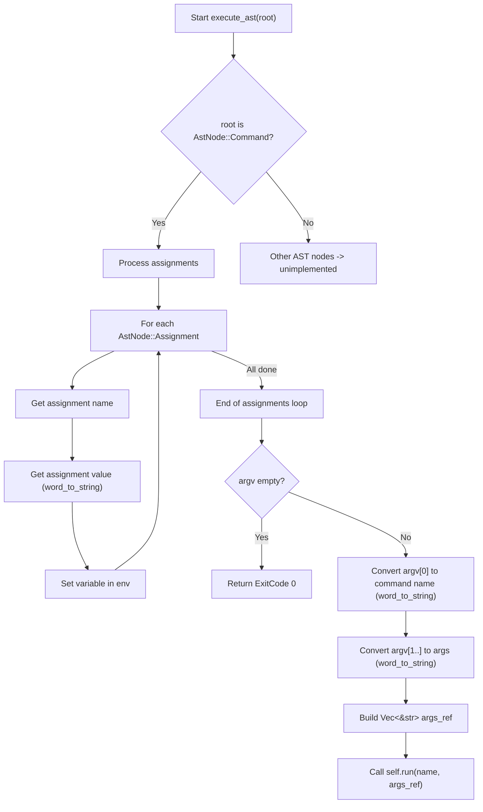

#  Архитектура CLI

Прежде всего стоит определить набор необходимых для работы компонентов:

* **Лексер** - дробление исходной строки на токены:
    
    * Группировка по `"` или `'` в один токен
    * Классификация операторов
    * Реализовать токены можно с помощью `enum` в Rust
    * Представляет собой автомат, котороый читает поток входных символов и трансформирует их в последовательность токенов

* **Парсер** - анализ последовательности токенов
    
    * Валидация с точки зрения синтаксиса
    * Тут можем объединить последовательности токенов в команды, чтобы работать с пайпами
    * По последовательности токенов строит абстрактное синтаксическое дерево, которое также реализовано через `enum`

* **Expander** 

    * Делает проход по токенам, подставляет значения переменных 

* **Environment Manager** - тут лежат всякие переменные окружения, `PATH` и т.п.

    * Парсится при старте интерпретатора из `.clirc` файла
    * Может быть изменено командами типа `A=21`

* **Cmd-executor** 
    * Запускает команды, ждет их завершения, управляет временем жизни
    * Инициализирует всякие файлы для пайпов
    * Может менять конфигурацию
    * Имеет вшитые (захардкоженные) команды:
        * `pwd` -- сами знаем свой pwd, нет смысла дергать другие приложения
        * `cd` -- только мы сами можем изменить свой `pwd`. Команды нет в тз, но без нее странно
        * `exit` -- только мы можем сами закрыть себя
    * Остальные команды будем искать в `PATH`, который в конфигурации (так добьемся расширения штуками о которых не знали рагьше):
        * `cat` -- отдельное приложение
        * `echo` -- отдельное приложение
        * `wc` -- отдельное приложение там, где PATH нас найдет
    * Запуск команд, можно унифицировать через паттерн `Command`, скрывая API вшитых команд, изменение переменных и т.п. Команды с `|`, то можно инкапсулировать в одну `Command` внутри интерпретатора (например наследник `PipelineCommand`)


## План реализации в 2 этапа

### 1 стадия -- Без |

1. Реализовать `Environment Manager`
1. Реализовать в виде свободных функций (описаны как компоненты `Lexer`, `Parser`, `Expander`). Можно объединить под эгидой единого `CommandBuilder`-а
1. Реализовать рантайм, который будет исполнять команды

### 2 стадия -- С |

1. Докрутить `CommandBuilder`:
    * Поддержать пайпы в лексере
    * Изменить функцию синтаксического анализа
    * Expander -- без изменений
    * Реализовать наследника `PipelineCommand`
  
### Диаграмма компонентов



## Алгоритм лексического анализа:

Алгоритм лексического анализа реализован с помощью конечного автомата (FSM), инкапсулированного в структуре `LexingFSM`. Он обрабатывает входную строку посимвольно, переходя между состояниями, которые определяют контекст обработки (например, внутри слова, внутри одинарных кавычек, внутри подстановки).

**Состояния лексера:**

* `Start` -- Начальное состояние, ожидание нового токена
* `ReadingWord` -- Чтение части слова вне кавычек
* `ReadingSingleQuote` -- Чтение внутри '...' (буферизуется как Literal)
* `ReadingDoubleQuote` -- Чтение внутри "..." (допускает подстановки)
* `ReadingCmdSubst(depth)` -- Чтение внутри $(...)
* `ReadingParamSubst(depth)` -- Чтение внутри ${...}

В коде:

```rust
#[derive(Debug, Clone, PartialEq, Eq)]
pub enum WordPart {
    /// Literal text that requires no further processing.
    Literal(String),
    /// Command substitution in the format `$(...)`. Contains the text inside the parentheses.
    CmdSubst(String),
    /// Parameter substitution in the format `${...}`. Contains the text inside the curly braces.
    ParamSubst(String),
}

#[derive(Debug, Clone, PartialEq, Eq)]
pub enum Token {
    /// A word token, which may be composed of multiple parts (`WordPart`).
    Word(Vec<WordPart>),
    /// The pipe operator, `|`.
    PipeOp,
    /// The equality symbol, `=`.
    Equal,
    /// The slash symbol (path separator), `/`.
    Slash,
    /// Input redirection symbol, `<`.
    RedirectLeft,
    /// Output redirection symbol, `>`.
    RedirectRight,
}
```

---
### Граф переходов:


---

### Работа с подстановками:

Каждая подстановка считается частью слова. Лексер переходит в специальное состояние, считает вложенность скобок, и когда конструкция полностью закрыта — возвращается в обычный разбор слова. Благодаря этому корректно работают вложенные и смешанные подстановки 

#### Командная подстановка `$(...)`

При встрече последовательности `$(` лексер переходит в состояние `ReadingCmdSubst(depth=1)`.
Каждая открывающая скобка `(` увеличивает depth, каждая закрывающая `)` уменьшает.
Когда `depth` возвращается к `1` и встречается `)`, подстановка завершается, накопленный текст превращается в `WordPart::CmdSubst`.
Этот механизм естественным образом поддерживает произвольную вложенность: ```$(echo $(date))```.

#### Параметрическая подстановка `${...}`

Обрабатывается аналогично: при `${` лексер переходит в `ReadingParamSubst(depth=1)`.
Внутренние `{` увеличивают глубину, `}` уменьшают.
Возврат depth к `1` и закрывающая `}` завершают подстановку, создавая `WordPart::ParamSubst`.

#### Простая подстановка `$var`

До закрывающей кавычки или разделителя символ `$` начинает буфер, в который накапливаются символы.
После завершения фрагмента он интерпретируется как `WordPart::ParamSubst("var")`.
Если формат некорректный, фрагмент трактуется как обычный литерал.

### Алгоритм синтаксического анализа

На этой стадии строится абстрактное синтаксическое дерево. Функциональность реализована с помощью паттерна `Builder`.

```rust
/// A shell word, either a simple literal or a compound (with substitutions)
#[derive(Debug, Clone, PartialEq)]
pub enum Word {
    Literal(String),
    Compound(Vec<WordPart>),
}

/// AST node for the shell
///
/// Represents a single element in the Abstract Syntax Tree (AST) constructed
/// from the parsed shell commands. This enum captures the various structural
/// components of a shell script or command line.
#[derive(Debug)]
pub enum AstNode {
    /// A **pipeline** of commands connected by the pipe operator (`|`).
    /// The inner `Vec<AstNode>` contains the individual commands in execution order.
    Pipeline(Vec<AstNode>),

    /// A **simple command** unit, which includes the command name and its arguments,
    /// variable assignments preceding the command, and I/O redirections.
    Command {
        /// The vector of words forming the command name and its arguments (`argv[0]`, `argv[1]`, etc.).
        argv: Vec<Word>,
        /// A list of preceding variable assignments that only apply to this command's environment.
        assignments: Vec<AstNode>,
        /// A list of I/O redirection specifications for this command.
        redirects: Vec<AstNode>,
    },

    /// A **variable assignment** statement in the form `name=value`.
    /// This can occur either globally or locally within a `Command`.
    Assignment {
        /// The name of the variable being assigned.
        name: String,
        /// The value assigned to the variable. `None` if the assignment is just `name=` (empty string value).
        value: Option<Word>
    },

    /// An **I/O redirection** specification (e.g., `>`, `<`, `>>`, `2>&1`).
    Redirect {
        /// The specific type of redirection (e.g., input, output, append, descriptor duplication).
        kind: RedirectKind,
        /// The file or descriptor target of the redirection.
        target: Word
    },

    /// A **substitution** expression, such as command substitution `$(...)` or
    /// variable substitution `${...}` (depending on the shell's full feature set).
    Substitution {
        /// The specific type of substitution (e.g., Command, Variable).
        kind: SubstKind,
        /// The fully parsed AST of the inner content. For command substitution,
        /// this is typically the AST of the command or pipeline being executed.
        content: Box<AstNode>,
    },
}

/// Kind of redirection
///
/// Defines the specific operation mode for an I/O redirection (`<`, `>`, `>>`).
#[derive(Debug)]
pub enum RedirectKind {
    /// Input redirection (`<`): Reads standard input from a specified file.
    Input,
    /// Output redirection (`>`): Writes standard output to a file, **overwriting** the file if it exists.
    Output,
    /// Output redirection with append (`>>`): Writes standard output to a file, **appending** to the file if it exists.
    Append,
}

/// Kind of substitution
///
/// Defines the type of substitution syntax encountered in a command word.
#[derive(Debug)]
pub enum SubstKind {
    /// **Command substitution** (`$(...)`): Executes the enclosed command/pipeline
    /// and replaces the substitution with the command's standard output.
    Command,    // $(...)
    /// **Parameter substitution** (`${...}`): Evaluates and replaces the expression
    /// with the value of a variable or a related expression.
    Parameter, // ${...}
}
```

---

### Блок схема алгоритма работы рекурсивного парсера



---

### Исполнение команд по AST (без внедренных Pipe-ов)



#### Исполнение команд по AST (с внедренными Pipe-ами)

```mermaid
stateDiagram-v2
    direction LR
    
    [*] --> ExecuteAST

state ExecuteAST {
        ExecuteAST --> SimpleCommand : AstNode::Command
        ExecuteAST --> PipelineExecution : AstNode::Pipeline
        ExecuteAST --> Unsupported : Other
    }
    
    ---

    state SimpleCommand {
        SimpleCommand: Execute Command
        [*] --> ApplyAssignments: Присваивание VAR=VAL (модификация self.env)
        ApplyAssignments --> CheckEmptyArgv
        CheckEmptyArgv -->|argv пуст| [*]: Return Ok(0)
        CheckEmptyArgv -->|argv не пуст| ResolveArgs: name/args через word_to_string(self.env)
        ResolveArgs --> Run: Вызов self.run(&name, &args_ref)
        Run --> [*]
    }

    ---

    state PipelineExecution {
        PipelineExecution: Pipeline Execution (|)
        [*] --> InitPipeline: Init previous_output, last_exit
        InitPipeline --> LoopPipeline
        
        state LoopPipeline {
            LoopPipeline: Итерация по командам
            [*] --> ApplyLocalEnv: Клон self.env; Присваивания VAR=VAL к local_env
            ApplyLocalEnv --> ResolveArgsPipe: name/args через local_env (mem::replace)
            ResolveArgsPipe --> CheckCommandType
            
            state CheckCommandType {
                CheckCommandType -->|Внешняя (PATH lookup)| ExternalProcess
                CheckCommandType -->|Встроенная (Built-in)| InternalCommand
            }
            
            state ExternalProcess {
                ExternalProcess: External Command (Spawn)
                [*] --> Spawn: std::process::Command (envs из self.env)
                Spawn --> PipeInput: previous_output в child stdin
                PipeInput --> Wait: wait_with_output
                Wait --> UpdateStateExternal: Store stdout в previous_output; Store exit code
                UpdateStateExternal --> NextIteration
            }
            
            state InternalCommand {
                InternalCommand: Internal Command (Factory)
                [*] --> CreateCmd: factory.try_create(...)
                CreateCmd --> Execute: cmd.execute(..., self.env.clone())
                Execute --> UpdateStateInternal: Store captured output (MemWriter) в previous_output; Store exit code
                UpdateStateInternal --> NextIteration
            }
            
            NextIteration -->|Есть команды| LoopPipeline
            NextIteration -->|Нет команд| WriteFinalOutput
        }
        
        WriteFinalOutput --> WriteToFinal: final_stdout.write_all(previous_output)
        WriteToFinal --> [*]: Return Ok(last_exit)
    }

    ---
    
    state Unsupported {
        Unsupported --> [*]: Return unimplemented! error
    }
```