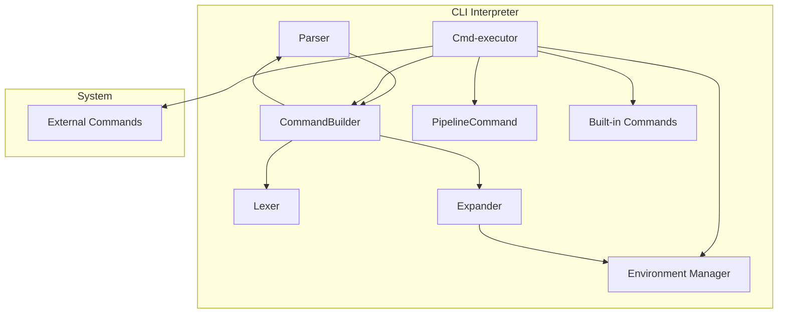

#  Архитектура CLI

Прежде всего стоит определить набор необходимых для работы компонентов:

* **Лексер** - дробление исходной строки на токены:
    
    * Группировка по `"` или `'` в один токен
    * Классификация операторов
    * Реализовать токены можно с помощью `enum` в Rust

* **Парсер** - анализ последовательности токенов
    
    * Валидация с точки зрения синтаксиса
    * Тут можем объединить последовательности токенов в команды, чтобы работать с пайпами

* **Expander** 

    * Делает проход по токенам, подставляет значения переменных 

* **Environment Manager** - тут лежат всякие переменные окружения, `PATH` и т.п.

    * Парсится при старте интерпретатора из `.clirc` файла
    * Может быть изменено командами типа `A=21`

* **Cmd-executor** 
    * Запускает команды, ждет их завершения, управляет временем жизни
    * Инициализирует всякие файлы для пайпов
    * Может менять конфигурацию
    * Имеет вшитые (захардкоженные) команды:
        * `pwd` -- сами знаем свой pwd, нет смысла дергать другие приложения
        * `cd` -- только мы сами можем изменить свой `pwd`. Команды нет в тз, но без нее странно
        * `exit` -- только мы можем сами закрыть себя
    * Остальные команды будем искать в `PATH`, который в конфигурации (так добьемся расширения штуками о которых не знали рагьше):
        * `cat` -- отдельное приложение
        * `echo` -- отдельное приложение
        * `wc` -- отдельное приложение там, где PATH нас найдет
    * Запуск команд, можно унифицировать через паттерн `Command`, скрывая API вшитых команд, изменение переменных и т.п. Команды с `|`, то можно инкапсулировать в одну `Command` внутри интерпретатора (например наследник `PipelineCommand`)

## План реализации в 2 этапа

### 1 стадия -- Без |

1. Реализовать `Environment Manager`
1. Реализовать в виде свободных функций (описаны как компоненты `Lexer`, `Parser`, `Expander`). Можно объединить под эгидой единого `CommandBuilder`-а
1. Реализовать рантайм, который будет исполнять команды

### 2 стадия -- С |

1. Докрутить `CommandBuilder`:
    * Изменить регулярные выражения в функции лексического анализа
    * Изменить функцию синтаксического анализа
    * Expander -- без изменений
    * Реализовать наследника `PipelineCommand`
  
### Диаграмма компонентов

