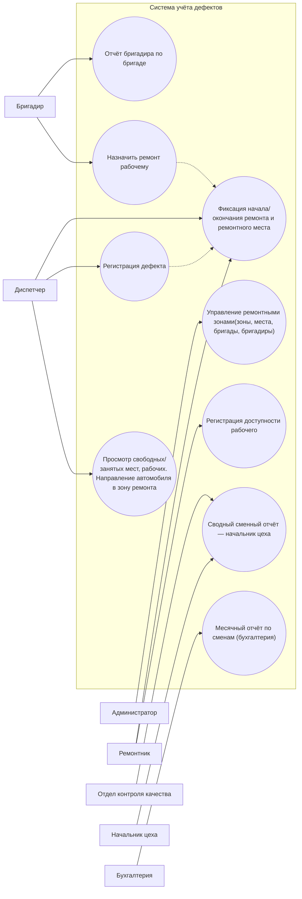
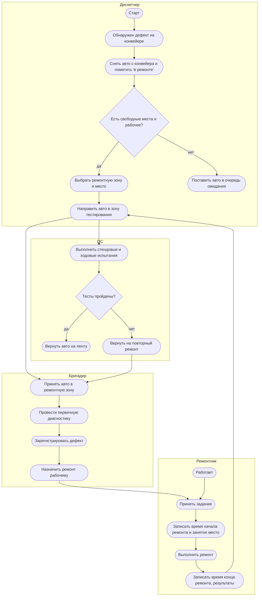

1. Диаграмма случаев использования приложения

```mermaid
flowchart LR
  subgraph System["Система учёта дефектов"]
    UC1(("Управление ремонтными зонами(зоны, места, бригады, бригадиры)"))
    UC2(("Регистрация дефекта"))
    UC3(("Фиксация начала/окончания ремонта и ремонтного места"))
    UC4(("Назначить ремонт рабочему"))
    UC5(("Регистрация доступности рабочего"))
    UC6(("Просмотр свободных/занятых мест, рабочих. Направление автомобиля в зону ремонта"))
    UC7(("Сводный сменный отчёт — начальник цеха"))
    UC8(("Отчёт бригадира по бригаде"))
    UC9(("Месячный отчёт по сменам (бухгалтерия)"))
  end

  Admin[Администратор] --> UC1
  Dispatcher[Диспетчер] --> UC6
  Dispatcher --> UC2
  Dispatcher --> UC3
  Brigadier[Бригадир] --> UC4
  Brigadier --> UC8
  Worker[Ремонтник] --> UC5
  Worker --> UC3
  QC[Отдел контроля качества] --> UC7
  Manager[Начальник цеха] --> UC7
  Accountant[Бухгалтерия] --> UC9

  UC2 -.-> UC3
  UC4 -.-> UC3
```

2. Диаграмма активностей

```mermaid
flowchart TB
  subgraph D["Диспетчер"]
    direction TB
    start([Старт])
    detect([Обнаружен дефект на конвейере])
    taken([Снять авто с конвейера и пометить 'в ремонте'])
    checkFree{Есть свободные места и рабочие?}
    choose([Выбрать ремонтную зону и место])
    sendZone([Направить авто в зону тестирования])
    queue([Поставить авто в очередь ожидания])
  end

  subgraph B["Бригадир"]
    direction TB
    accept([Принять авто в ремонтную зону])
    diag([Провести первичную диагностику])
    register([Зарегистрировать дефект])
    assign([Назначить ремонт рабочему])
  end

  subgraph W["Ремонтник"]
    direction TB
    regAvail([Работает])
    take([Принять задание])
    startRepair([Записать время начала ремонта и занятое место])
    doRepair([Выполнить ремонт])
    finishRepair([Записать время конца ремонта, результаты])
  end

  subgraph Q["QC"]
    direction TB
    qcTest([Выполнить стендовые и ходовые испытания])
    qcOk{Тесты пройдены?}
    qcPass([Вернуть авто на ленту])
    qcFail([Вернуть на повторный ремонт])
  end

  start --> detect --> taken --> checkFree
  checkFree -->|да| choose --> sendZone --> accept
  checkFree -->|нет| queue
  accept --> diag --> register --> assign --> take
  regAvail --> take
  take --> startRepair --> doRepair --> finishRepair --> sendZone
  sendZone --> qcTest --> qcOk
  qcOk -->|да| qcPass
  qcOk -->|нет| qcFail --> accept
```

3. BPMN-схема завода

```mermaid
flowchart LR
  subgraph Dealer["Дилер"]
    D1([Разместить заказ на необходимую модель автомобиля])
  end

  subgraph Planning["Планирование"]
    P1([Сформировать производственный план])
  end

  subgraph Body["Сборка запчастей"]
    S1([Производство запчастей])
    S2([Контроль качества])
    S3{Дефект обнаружен?}
  end

  subgraph Paint["Покраска"]
    PA1([Покраска и выдержка])
    PA2([Контроль качества])
    PA3{Дефект обнаружен?}
  end

  subgraph QCPart["Сборка"]
    C1([Сборка автомобиля])
    C2{Дефект обнаружен?}
  end

  subgraph Dispatcher["Диспетчер"]
    DS1([Снять авто с линии, направить в ремонтную зону])
  end

  subgraph Repair["Ремонтная зона (бригада)"]
    R1([Диагностика, регистрация дефекта])
    R2([Назначить ремонтник и место])
    R3([Исправление дефекта])
    R4([Фиксация времени и результатов])
  end

  subgraph QC2["QC (повторная проверка)"]
    QC2a([Повторная проверка])
  end

  subgraph Testing["Тестирование собранного автомобиля"]
    T1([Прохождение испытаний])
    T2{Испытания пройдены?}
  end

  subgraph Shipping["Отгрузка"]
    SH1([Отгрузить клиенту])
  end

  subgraph Accounting["Бухгалтерия"]
    ACC1([В конце месяца сформировать отчёт по сменам])
  end

  D1 --> P1 --> S1 --> S2 --> S3 
  C2 -->|да — есть дефект| DS1 --> R1 --> R2 --> R3 --> R4 --> QC2a --> C2
  C2 -->|нет| T1 --> T2
  S3 -->|да - есть дефект| DS1
  S3 -->|нет| PA1
  PA1 --> PA2 --> PA3
  PA3 --> |да - есть дефект| DS1
  PA3 --> |нет| C1 --> C2
  T2 -->|да - испытания пройдены| SH1 --> ACC1
  T2 -->|нет - есть деффекты| DS1
```

Команда:
- Берсенёв Артур
- Еленский Михаил
- Коннов Илья
- Королев Артем